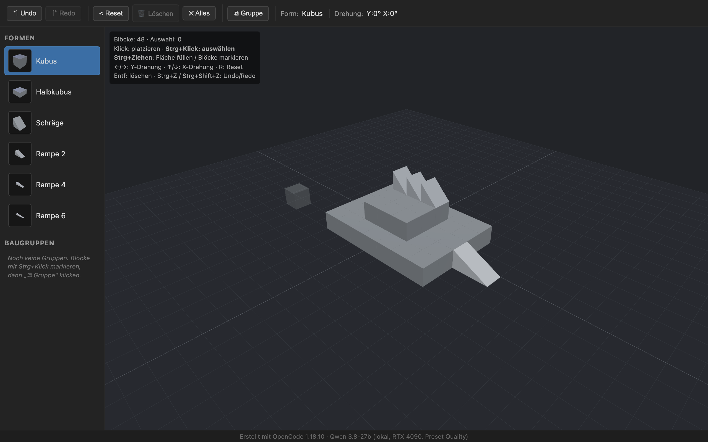

# Voxel Building Tool

Ein Voxel-basiertes 3D-Bauwerkzeug im Browser — zum Entwerfen und Testen von
**7dtd-Buildings** (Project Zomboid). Reines Design- & Test-Tool: Es gibt
bewusst **keinen** 7dtd-Export, sondern ein freies Voxel-Raster zum Ausprobieren
von Grundrissen, Dächern und Rampen.

**Live:** <https://keno303.github.io/voxeleditor-qwen3.8-27b/>



## Features

- **Freies Voxel-Raster** auf der X-Z-Ebene (Y = hoch), unendlicher Grundriss
- **6 datengetriebene Formen** (Kubus, Halbkubus, Schräge, Rampen 2/4/6) — neue
  Form = ein Eintrag in `src/shapeDefs.js`, ohne zusätzlichen Code
- **3D-Vorschau** der gewählten Form folgt dem Mauszeiger (Ghost-Mesh)
- **Drehung** in 90°-Schritten (Y- und X-Achse) für Form-Vorschau *und* platzierte Blöcke
- **Auswahl** (Strg+Klick, orange Markierung) und **Flächenfüllen** (Strg+Ziehen)
- **Baugruppen**: mehrere Blöcke zu einer benannten Gruppe zusammenfassen und
  als Ganzes platzieren/drehen
- **Undo / Redo** über die komplette Aktions-Historie
- **Kamera** per OrbitControls (drehen, pannen, zoomen)
- Komplett **offline** lauffähig (Three.js wird lokal gebundelt)

## Steuerung

| Eingabe | Aktion |
|---------|--------|
| **Klick** | Form am Zielplatzieren |
| **Strg + Klick** | Block auswählen / abwählen (additiv) |
| **Strg + Ziehen** (Boden) | Fläche mit der aktiven Form füllen |
| **Strg + Ziehen** (Blöcke) | mehrere Blöcke auswählen |
| **← / →** | um 90° in Y drehen |
| **↑ / ↓** | um 90° in X drehen |
| **R** / ⟲ | Drehung neutral setzen (Block oder Vorschau) |
| **Entf** / **Backspace** | Auswahl löschen |
| **Strg + Z** | Undo |
| **Strg + Shift + Z** / **Strg + Y** | Redo |
| **Esc** | Auswahl aufheben |
| **Linke Maustaste** (ziehen) | Kamera drehen |
| **Rechte Maustaste** (ziehen) | Kamera pannen |
| **Mausrad** | Zoom |

> Die Pfeiltasten drehen den **ausgewählten** Block; ohne Auswahl drehen sie die
> **Form-Vorschau** vor dem nächsten Platzieren.

## Formen

| ID | Name | Footprint | Beschreibung |
|----|------|-----------|--------------|
| `cube` | Kubus | 1×1×1 | Volles Voxel |
| `half` | Halbkubus | 1×1×1 | Halbe Höhe (0.5) |
| `slope` | Schräge | 1×1×1 | Diagonale Prismenfläche |
| `ramp2` | Rampe 2 | 2×1×1 | Steigt 1 Voxel über 2 Blöcke |
| `ramp4` | Rampe 4 | 4×1×1 | Steigt 1 Voxel über 4 Blöcke |
| `ramp6` | Rampe 6 | 6×1×1 | Steigt 1 Voxel über 6 Blöcke |

Rampen/Schräge sind **Prismen**: ein 2D-Profil wird über die volle Voxellänge
extrudiert (kein Clipping). Neue Formen werden in `src/shapeDefs.js` definiert.

## Tech-Stack & Architektur

- **Vite** — Build-Tool & Dev-Server (`base: './'` für GitHub Pages)
- **Vanilla JavaScript** (ES-Modules) — **kein** Frontend-Framework
- **Three.js** — einzige Runtime-Abhängigkeit (Scene, Kamera, Renderer, Raycasting)
- **Handgeschriebene UI** — plain HTML + CSS in `index.html`, keine
  Component-Library, kein CSS-Framework, kein State-Manager

### Projektstruktur

```
index.html            Markup + CSS (Toolbar, Palette, Viewport, Fußzeile)
src/
  main.js             Entry Point, verkabelt Scene/Editor/UI, Tastatur
  scene.js            Three.js-Scene, Kamera, Renderer, Raycast, OrbitControls
  editor.js           Kernlogik: Platzieren/Auswählen/Drehen/Löschen, Undo/Redo
  shapeDefs.js        Datengetriebene Form-Definitionen (6 Formen)
  shapes.js           Geometrie- & Farb-Erzeugung aus den Defs
  state.js            State + Historie (selbstgebaut)
  ui.js               DOM-Wiring (Buttons, Palette, Toasts, Gruppen-Panel)
  groups.js           Baugruppen-Logik
  preview.js          3D-Vorschauen für die Palette (Offscreen → PNG)
test-headless.mjs     Headless-Smoke-Test (Puppeteer + System-Chrome, WebGL)
make-screenshot.mjs   Erzeugt docs/screenshot.png (Demo-Struktur)
docs/screenshot.png   Screenshot für diese Doku
.github/workflows/deploy.yml  Auto-Deploy nach gh-pages bei Push auf main
```

## Lokal entwickeln

```bash
npm install     # Abhängigkeiten (three, vite, puppeteer-core)
npm run dev     # Dev-Server → http://localhost:5173
npm run build   # Produktion-Build → dist/
npm run preview # Build lokal ausliefern
npm test        # Headless-Smoke-Test (braucht Google Chrome)
```

Der Test nutzt `puppeteer-core` mit dem systemweiten Chrome und Swiftshader-
WebGL-Flags (läuft ohne GPU). Debug-Hooks liegen auf `window`:
`__editor`, `__state`, `__scene` (u. a. `__scene.projectToScreen(x,y,z)`).

## Deployment

Jeder Push auf `main` triggert den Workflow `.github/workflows/deploy.yml`,
der baut und deployt `dist/` per `peaceiris/actions-gh-pages` nach `gh-pages`.
Die Site läuft auf
<https://keno303.github.io/voxeleditor-qwen3.8-27b/>.

---

**Erstellt mit** OpenCode 1.18.10 · Qwen 3.8-27b (lokal, RTX 4090, Preset Quality)
